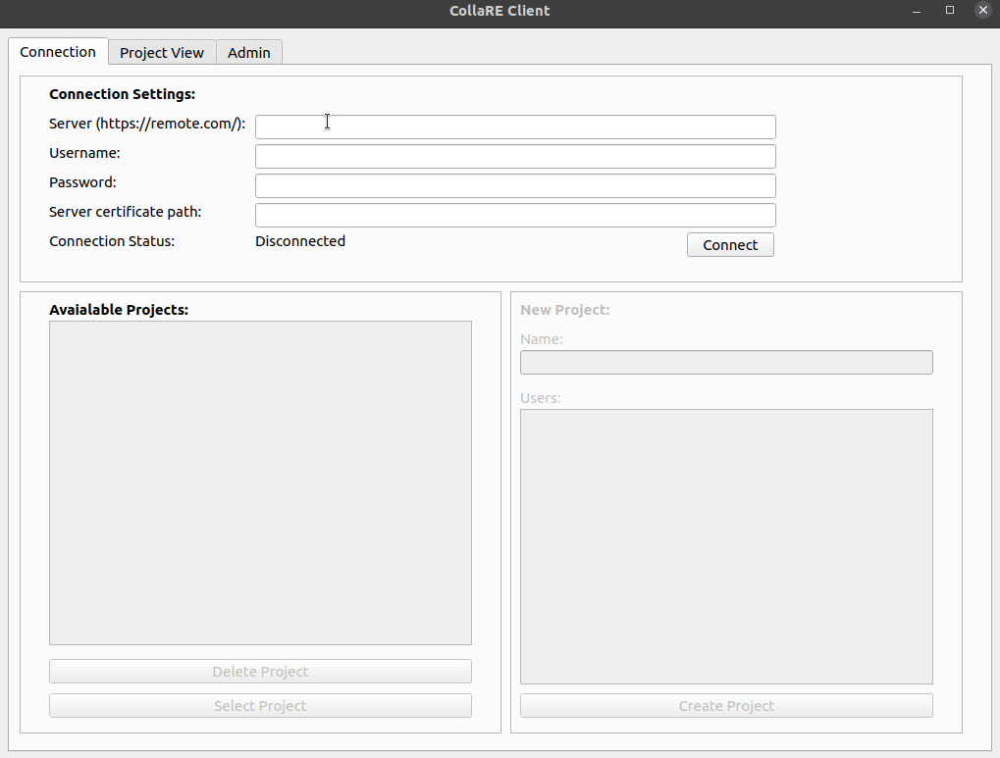
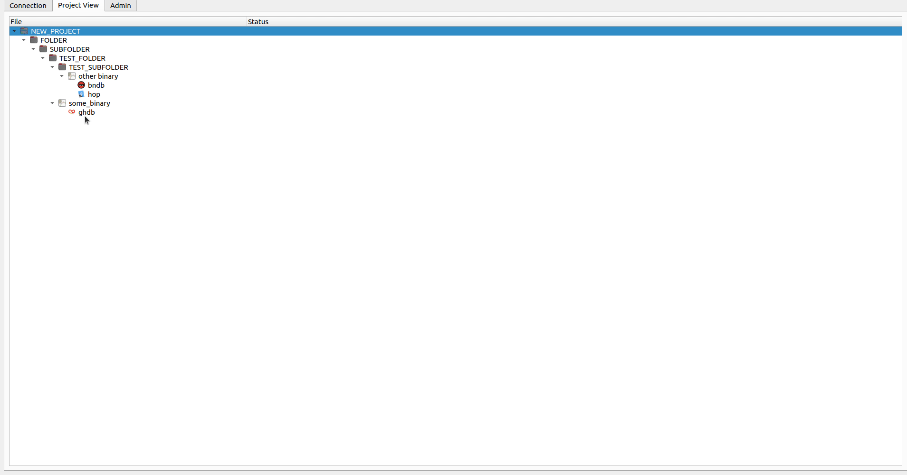

# CollaRE v0.3


## Intorduction

CollareRE is a tool for collaborative reverse engineering that aims to allow teams that do need to use more then one tool during a project to collaborate without the need to share the files on a separate locations. It also contains a very simple user management and as such can be used for a multi-project servers where different teams work on different projects.
The [back-end](https://github.com/Martyx00/CollaREServer) of the tool is a simple `Flask app` with `nginx` in front of it running in Docker that works with files and JSON based manifests that hold the relevant data. The front-end is a PyQT based GUI tool with a simple interface that allows managing the projects and working with the binary files and their corresponding reverse engineering databases. As of now the tool supports `Binary Ninja`, `Cutter (Rizin)`, `Ghidra`, `Hopper Dissassembler`, `IDA` and `JEB`. The implementation is abstracted from the inner workings of these tools as much as possible to avoid issues with any API changes and thus does not integrate directly into those tools in form of a plugin (might change in the future). The work is based purely on managing the files produced by these tools (literally just based on the well known file extensions) and a simple SVN style `check-out` and `check-in` operations.

## Installation

Download/clone this repository and run `sudo python3 setup.py install`. On Linux this will install the tool to the `PATH` and you will be able to run it simply with `collare` command. On Windows this will put the file into the `C:\Users\<USERNAME>\AppData\Local\Programs\Python\<PYTHON_VERSION>\Scripts\collare.exe` (depending on how you installed Python).

For Gnome based desktop UIs you can use following desktop file (paths to files may vary):
```
[Desktop Entry]
Type=Application
Encoding=UTF-8
Name=CollaRE
Exec=/usr/local/bin/collare
Icon=/usr/local/lib/python3.8/dist-packages/collare-0.1-py3.8.egg/collare/icons/collare.png
Terminal=false

```

## Supported Tools

### Cutter (Rizin)

To enable support for this tool add a file `Cutter` to your path (when you open `cmd`/`terminal` writing `Cutter` should start the application). 
When saving Cutter (rizin) projects you have to manually append `.rzdb`. Do not remove the extension that the file already has (`exe` or `so` for example).

### Binary Ninja

To enable support for this tool add a file `binaryninja` to your path (when you open `cmd`/`terminal` writing `binaryninja` should start the application).
Binary Ninja is removing file extensions by default, however the tool accounts for this so there is no need to put the original file extension back manually. Saving the projects as is in a default path is enough to be able to successfully push local `bndb` database.

### Hopper Disassembler

To enable support for this tool add a file `Hopper` to your path (when you open `cmd`/`terminal` writing `Hopper` should start the application).
Hopper is removing file extensions by default, however the tool accounts for this so there is no need to put the original file extension back manually. Saving the projects simply with `Ctrl+S` is enough to be able to successfully push local `hop` database.

### JEB

To enable support for this tool add a file `jeb` to your path (when you open `cmd`/`terminal` writing `jeb` should start the application). This can be done by renaming the default runner script file for your OS to `jeb` (for Windows this would actually be `jeb.bat`).

### IDA Pro

To enable support for this tool add a files `ida64` and `ida` to your path (when you open `cmd`/`terminal` writing `ida64`/`ida` should start the application).

### Ghidra

To enable support for this tool add a file `ghidraRun` and `analyzeHeadless` (`.bat` for Windows) to your path (when you open `cmd`/`terminal` writing `ghidraRun` should start the application). Note that `analyzeHeadless` is in `support` folder in the Ghidra root directory so make sure to adjust PATH to accommodate both files.
The process of initializing the database with Ghidra is a bit more complicated as there is no way that Ghidra will process file [without creating a project](https://github.com/NationalSecurityAgency/ghidra/issues/629). So to be able to push the Ghidra database (referred to as `ghdb`) you will be prompted to create a project manually whenever automatic processing fails (basically whenever the file you process is not ELF/PE) and then specify the path to the `gpr` file (sorry for that).

### Android Studio

As APK and JAR files are often encountered during the reverse engineering efforts the CollaRE tool also supports working with these types of files. To enable support for these tools it is necessary to make sure that files `android-studio` and `jadx` are in the path. The [JADX](https://github.com/skylot/jadx) tool is used to perform the decompilation of the JAR/APK file and the [Android Studio](https://developer.android.com/studio) is used to open the resulting files. Note that use of Android Studio is optional as you can alias any other tool that handles Gradle projects under `android-studio` command (such as IntelliJ IDEA).

## Usage

After deploying the server side as mentioned in its own readme file, it is necessary to distribute the used certificate file to all users of the application as well as use the default `admin` account with `admin` password to create other user accounts (don't forget to change password of `admin` user) via the `Admin` tab. When the users are configured anyone can create their own projects and start working with the tool itself.

### Creating projects

To create a project user has to first authenticate to the remote server by entering the URL, credentials and provide a certificate to validate the server identity. After that, the status will change to `Connected` and it is possible to select or delete existing projects or create a new project by simply entering the name (alphanumeric characters and `_` only) and selecting users that will be participating on the project (can be changed later in the `Admin` tab). Note that the user that is creating the project is automatically added to the user list so you do not have to select yourself.



### Project Structure and File Uploads

Once you are on the `Project View` tab you can create new folders (alphanumeric characters and `_` only, sorry) and use drag and drop to upload files (or folders).


### Pushing Local DB Files

Since the tool currently does not have any plugins or native hooks that would allow automatic uploads when the project is saved it is required that the local DB file push is triggered manually after creating the desired databases. This can be done by right-clicking on the uploaded binary file and choosing the tool you want to process the binary in. You can do basic analysis but it is strongly recommended to just save the file without changing anything (apart from appending `rzdb` in Cutter and completely different process with Ghidra). **DO NOT CHANGE THE PATH AND FILENAME**. After doing this and closing the disassembler you can just right click on the binary name and select option `Push Local DBs`. This will upload the local database and from now on when you want to work with the DB file you need to perform `Check-out`. Note that each binary can be processed in all the tools separately but only one DB file per binary and tool can exist.


### Working with DB Files

When you just want to inspect the file you can right-click the desired DB file and select option `Open File` (or just double-click). If the file is checked-out to you this will open the local file and you can freely perform any changes to the DB file. When done (or when you simply want to push the changes) you can select the `Check-in` option. This will upload the changes to the server and prompt you whether you want to keep the file checked-out for further changes. If you want to discard your local changes select the `Undo Check-out` option from the context menu. This will discard your changes and allow you to continue with the file from the server. Opening a file without doing a `Check-out` operation first will open it in a fake read-only mode (you can do changes to the DB file but those will be lost next time you check-out or open the file).




### Versioning

The tool also supports versioning the DB files in a way that every `Check-in` action counts as a new version of the DB file. You will be prompted to insert a comment for the version which is used to give more context to the changes that are applied in that version. It is then possible to open or check-out the previous versions of the files and work on those.

### Plugins

The plugins folder within this repository contains plugins for the supported tools which allow you to share comments and function names between the tools in case that you work on one binary with multiple tools. Follow the standard plugin installation instructions for the tool you are interested in. Each plugin offers an `Import` and an `Export` function. When you plan to share the data between the tools always make sure that you `Import` data first to avoid renaming functions that were already renamed by someone else. If the plugin comes with some catches, those are mentioned in the README file of the given plugin.

## Roadmap

* **v0.1** - Initial BETA release
* **v0.2** - BETA release with DB files versioning support
* **v0.3** - BETA release with comments/function names sync between DBs (PoC with two tools)
* **v1.0** - Initial production ready release with all major features implemented

## Disclaimer

I am not a good developer and I am even worse UI designer.